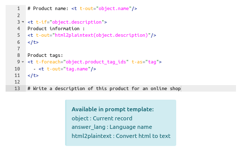

 

AI Connector
============

This technical module provides a connector for the AI platforms.

It can be used as a playground to test AI tools in Odoo but does not have standalone functionality.
The module is intended to be inherited by other modules for specific use cases.

## Configuration

In **Settings**, fill the **API Key** field with your generated key.

## Usage

### AI Completion

To create a new **AI Completion**, go to **Settings**, **Technical**, **AI Completion** and create a new record.

**Model**: The model on witch the completion will be applied.

**Target Field**: The field where the generated value will be saved.

**Domain**: The domain to select the records on witch the completion will be run.

For Completion results go to **Settings**, **Technical**, **AI Completion Results**

### Prompt template

Write a prompt template in Qweb.

Available functions in prompt template:
 - object : Current record
 - answer_lang : Function returning the language name
 - html2plaintext : Function to convert html to text

### Tests

Test actions use the first record of the model selected by the domain.

Test first your prompt to adjust your template, then test the result of the Completion to adjust AI parameters.

## Requirements

No requirements

## Maintainer

* This module is maintained by [Michel Perrocheau](https://github.com/myrrkel). 
* Contact me on [LinkedIn](https://www.linkedin.com/in/michel-perrocheau-ba17a4122). 

