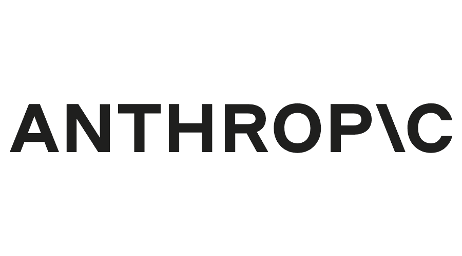

 

Anthropic AI Connector
=================

This technical module provides a connector for the Anthropic AI API.

To create custom Anthropic AI completions refer to the API documentation for proper configuration of API parameters. 

[Anthropic AI API Documentation](https://docs.anthropic.com/en/api/getting-started)

## Configuration

Create an account on [Anthropic](https://console.anthropic.com)

Generate your API key: [API keys](https://console.anthropic.com/settings/keys)

In **Settings**, fill the **API Key** field with your generated key.

## Requirements

This module requires the Python client library for Anthropic AI API

    pip install anthropic

## Maintainer

* This module is maintained by [Michel Perrocheau](https://github.com/myrrkel). 
* Contact me on [LinkedIn](https://www.linkedin.com/in/michel-perrocheau-ba17a4122). 

